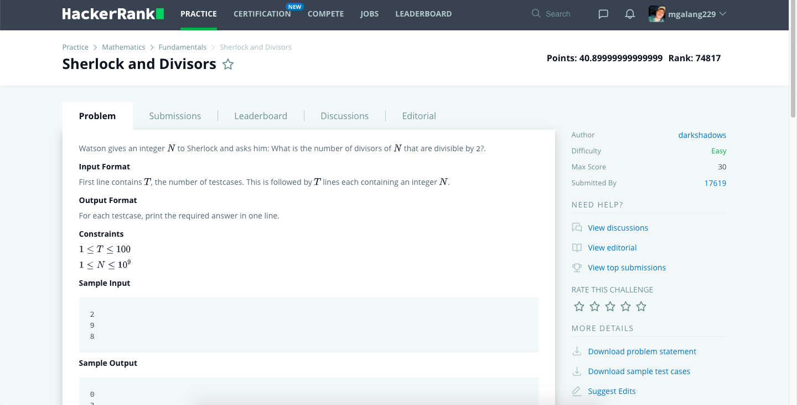

# Hackerrank-Sherlock-and-Divisors
### Problem

### Program Simulation
<pre>
  Sample Input: 9
  
  n = 9
  ans = 0
  
  * First Loop (Loop Until i * i < 9) *
    if(9 % 1 == 0) // true
      if(1 % 2 == 0) // false
      if((9 % 1) % 2 == 0) // false
      
  * Second Loop *
    if(9 % 2 == 0) // false
   
  * Third Loop *
    if(9 % 3 == 0) // true
      if(3 % 2 == 0) // false
      if((9 / 3) % 2 == 0) // false
      
  if(3 * 3 == 9 && i % 2 == 0) // false
  
  print ans
  
  Final Output: 
  0
  

  Sample Input: 8
  
  n = 8
  ans = 0
  
  * First Loop (Loop Until i * i < 8) *
    if(8 % 1 == 0) // true
      if(1 % 2 == 0) // false
      if((8 / 1) % 2 == 0) // true
        ans -> 1
  
  * Second Loop *
    if(8 % 2 == 0) // true
      if(2 % 2 == 0) // true
        ans -> 2
      if((8 / 2) % 2 == 0) // true
        ans -> 3
  
  if(2 * 2 == 8 && 2 % 2 == 0) // false
  
  print ans
  
  Final Output:
  3
</pre>
